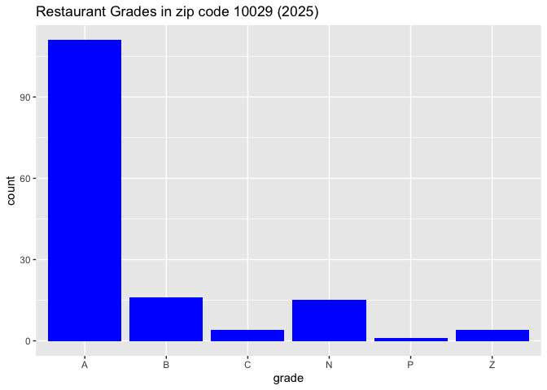

# Hello World!


# Introduction

This project investigates the 2025 New York City Restaurant Inspection
Results data from NYC OpenData. I love trying new restaurants in the
city and am adamant that the places we go to pass their health grades!
As a first step, I would like to understand the breakdown of grades for
restaurants in my neighborhood (as defined by being in the same area
code) and identify the restaurants to avoid.

\*Source file:
<https://data.cityofnewyork.us/Health/DOHMH-New-York-City-Restaurant-Inspection-Results/43nn-pn8j/about_data>

``` r
nyc_restaurant_grades <- read.csv("https://raw.githubusercontent.com/JessChen0/my-first-project/refs/heads/main/DOHMH_New_York_City_Restaurant_Inspection_Results_2025.csv")
```

## Analysis

### Restaurant Grades in 10029 area code (in 2025)

``` r
library(dplyr)
```


    Attaching package: 'dplyr'

    The following objects are masked from 'package:stats':

        filter, lag

    The following objects are masked from 'package:base':

        intersect, setdiff, setequal, union

``` r
library(janitor)
```


    Attaching package: 'janitor'

    The following objects are masked from 'package:stats':

        chisq.test, fisher.test

``` r
library(tidyverse)
```

    Warning: package 'ggplot2' was built under R version 4.5.2

    ── Attaching core tidyverse packages ──────────────────────── tidyverse 2.0.0 ──
    ✔ forcats   1.0.0     ✔ readr     2.1.5
    ✔ ggplot2   4.0.1     ✔ stringr   1.5.1
    ✔ lubridate 1.9.4     ✔ tibble    3.3.0
    ✔ purrr     1.1.0     ✔ tidyr     1.3.1

    ── Conflicts ────────────────────────────────────────── tidyverse_conflicts() ──
    ✖ dplyr::filter() masks stats::filter()
    ✖ dplyr::lag()    masks stats::lag()
    ℹ Use the conflicted package (<http://conflicted.r-lib.org/>) to force all conflicts to become errors

``` r
library(knitr)

nyc_restaurant_grades_cleaned <- nyc_restaurant_grades %>% filter(ZIPCODE=="10029")
nyc_restaurant_grades_cleaned <- nyc_restaurant_grades_cleaned %>% clean_names() 
nyc_restaurant_grades_cleaned <- nyc_restaurant_grades_cleaned[c("dba","boro","cuisine_description","grade","council_district")]
nyc_restaurant_grades_cleaned <- unique(nyc_restaurant_grades_cleaned)
nyc_restaurant_grades_cleaned %>% count(grade)
```

      grade   n
    1     A 111
    2     B  16
    3     C   4
    4     N  15
    5     P   1
    6     Z   4

### Restaurant Grades in 10029 area code (in 2025) graph

``` r
ggplot(nyc_restaurant_grades_cleaned, aes(x=grade)) + geom_bar(fill="blue") + ggtitle(paste0("Restaurant Grades in zip code 10029 (2025)"))
```



Where N = not graded yet, P and Z = pending.

### List of C grade restaurants to avoid!

``` r
nyc_restaurants_c_only <- nyc_restaurant_grades_cleaned %>% filter(grade=="C"|grade=="B")
nyc_restaurants_c_only %>% select(dba,cuisine_description,grade)
```

                             dba      cuisine_description grade
    1               NAUGHTY CRAB                  Seafood     B
    2                    MRS. AN                     Thai     B
    3        PEE DEE STEAK HOUSE                 American     C
    4           EMPEROR DUMPLING       Asian/Asian Fusion     B
    5          SAMS FAMOUS PIZZA                    Pizza     C
    6         FRENCHY COFFEE NYC                   French     B
    7              SUPREME PIZZA                    Pizza     B
    8         DA BIANCA PIZZERIA                    Pizza     B
    9            THAI PEPPERCORN                     Thai     B
    10         FINE FOOD CUISINE                 American     C
    11             K-STREET FOOD                   Korean     C
    12       Oriental Restaurant                  Chinese     B
    13     LA TROPEZIENNE BAKERY Bakery Products/Desserts     B
    14             K-STREET FOOD                   Korean     B
    15           STEAK & HOAGIES                  Chinese     B
    16      WING GONG RESTAURANT                  Chinese     B
    17              CHU ROS THAI                     Thai     B
    18        RICARDO STEAKHOUSE               Steakhouse     B
    19       LLOYD'S CARROT CAKE Bakery Products/Desserts     B
    20 BAWARCHI INDIAN CUISINE93                   Indian     B

## Conclusions

In this project, I have confirmed that majority of restaurants in my
neighbourhood have A grades. Furthermore, I have identified the 20 grade
B and C restaurants that I plan to avoid due to their violations.

If time allows, further analysis of violation types, grade distributions
compared with other neighborhoods and boroughs would be interesting.
